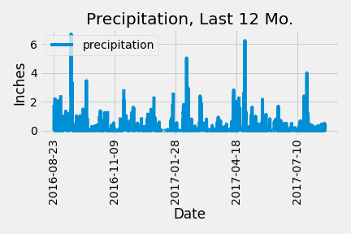
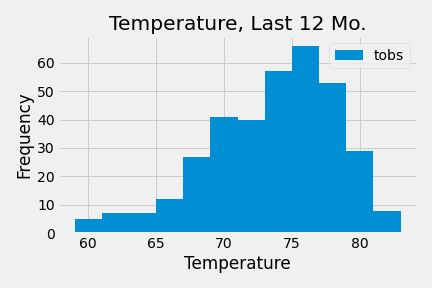

# sqlalchemy-challenge

# Intro

The purpose of this project was to first query data from a database using python, then analyze data before finally building an API using the aforementioned information.

# Data Set 

The data set consisted of a database containing information concerning the precipitation measurements of various stations in Hawaii.

# Method

The first step was to import needed libraries and construct the engine to access the SQL database using python. Next, the database was reflected to AutoMap the classes containing the information desired and references to said classes were created so that analysis could begin.

Once the classes could be accessed data about the precipitation covering 365 days since the most recent input data so that past years’ worth of rainfall could be graphed, and trends observed.

Afterwards, the API was constructed using Flask and Python, utilizing the same data queries made in the first half of the project.

# Analysis

In this project we observed the change in rainfall across various stations in Hawaii over the past year. No wild trends were observed, the available PNG files of the graphs made show a rhythmic rise and fall in inches of precipitation and steady climb, then fall in temperature as the year in question progressed, 

# Conclusion

 Using an ORM to communicate to a database, pull data, preform calculations, form data frames, and then graph the resulting information for analysis was impressive and provides a major resource for data analysis and manipulation through powerful, high-level languages/libraries made for that exact purpose. In addition to the data manipulation and analysis the information was made available through a local API. Something I never thought I would make after learning of their existence.
 
 Now that I have used these programs, analyzed data using two languages I didn't think could communicate before this week (Python & SQL), my view of information has changed forever. I don't think I'll ever use a website or application without considering what's happening behind the scenes to make them function.

